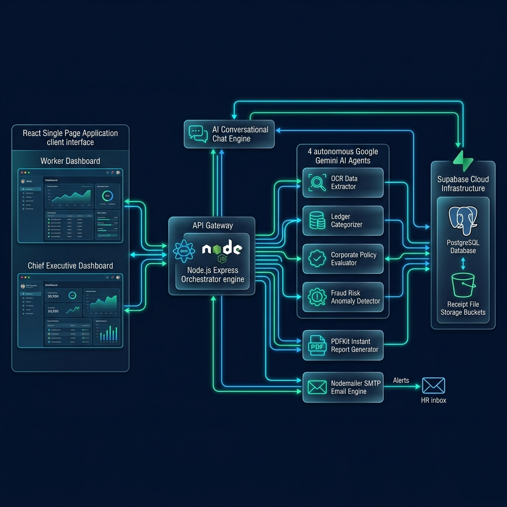

# ClearAudit — Enterprise AI-Powered Expense Auditing Platform 🚀📈


**ClearAudit** is a state-of-the-art, autonomous multi-agent corporate expense auditing platform. Designed to eliminate boardroom approval bottlenecks and manual accounting friction, ClearAudit leverages **Google Gemini AI** agents orchestrated by a reactive **Node.js Express** backend and a modern **React Single Page Application (SPA)** interface to deliver zero-latency expense lifecycle management.

---

## 🏛️ Comprehensive System Architecture



ClearAudit is structured around a central **State Machine Orchestrator** that coordinates data flows between client dashboards, AI reasoning engines, document generators, email dispatchers, and Supabase cloud infrastructure.

```
       +-----------------------------------------------------------------------+
       |                        React SPA Client (Vite)                        |
       |  [Worker Dashboard: Submissions]    [Chief Dashboard: Reactive CFO]   |
       +----------------------------------+------------------------------------+
                                          |
                                 3-Sec Live Polling
                                          v
       +-----------------------------------------------------------------------+
       |                  Node.js / Express State Orchestrator                 |
       |            (API Gateway | JWT Auth | Polling State Engine)            |
       +-----+-------------------+-----------------+---------------------+-----+
             |                   |                 |                     |
             v                   v                 v                     v
   +-------------------+  +--------------+  +--------------+  +--------------------+
   | AI Chat Engine    |  | 4 Gemini     |  | PDFKit JS    |  | Nodemailer SMTP    |
   | Intent Parsing    |  | AI Agents    |  | Report Eng.  |  | HR Dispatch Bridge |
   +-------------------+  +--------------+  +--------------+  +--------------------+
                                          |
                                          v
       +-----------------------------------------------------------------------+
       |                  Supabase Cloud Infrastructure (PostgreSQL)           |
       |      [Relational Audit Database]         [Receipt Binary Storage]     |
       +-----------------------------------------------------------------------+
```

---

## 🤖 The 4 Autonomous Gemini AI Agents (`Orchestrator.processJob`)

Whenever an employee submits an expense—either via drag-and-drop receipt upload or natural language chat prompt—the backend Orchestrator transitions the job through an autonomous pipeline of **four specialized Gemini AI Agents**:

1. **📄 OCR Data Extraction Agent (`Extracting Data`)**
   * **Function:** Ingests receipt image/PDF binary buffers or conversational text prompts.
   * **Mechanics:** Extracts key fiscal data points into strict JSON schema: `amount` (numeric), `date` (YYYY-MM-DD), and `merchant` name.
2. **🗂️ Ledger Categorization Agent (`Categorizing`)**
   * **Function:** Maps transactions into corporate general ledger accounts based on merchant semantic context.
   * **Categories:** *Travel & Transit*, *Meals & Entertainment*, *Software & Infrastructure*, *Office Supplies*, or *Miscellaneous*.
3. **🛡️ Corporate Policy Checker Agent (`Checking Policy`)**
   * **Function:** Cross-references extracted figures against corporate policy rules.
   * **Mechanics:** Verifies receipt document attachment presence and flags claims exceeding baseline company expense thresholds.
4. **🚨 Fraud & Risk Analysis Agent (`Analyzing Risk`)**
   * **Function:** Evaluates behavioral anomaly indicators.
   * **Mechanics:** Calculates fraud risk scores by detecting suspicious round numbers (e.g., exact $500.00 charges), category inflation anomalies (e.g., $500 for *Meals*), and abnormal submission velocity. High risk items transition state to `Flagged`.

---

## 👥 Dual User Role Dashboards (Worker vs. Chief)

ClearAudit features role-based access control (RBAC) delivering tailored user experiences:

### 💼 1. Worker Dashboard (`role === 'worker'`)
* **Demo Access:** `worker@clearaudit.inc` | **Pass:** `2`
* **Natural Language Chat Submission (`Ask ClearAudit`):** Employees can simply message the AI assistant: *"audit $35.50 from Uber on 2026-06-25 for client transit"*. The AI parses intent, extracts fields, and queues the job.
* **Live Pipeline Badges:** Because the client polls the server every 3 seconds, workers watch their submission progress live through the AI reasoning stages (`Extracting Data` ➔ `Categorizing` ➔ `Approved` / `Flagged`).
* **Interactive Calendar View:** Transparently tracks monthly spending with dual color-coded status badges (**Green** for cleared approvals, **Amber** for flagged claims).
* **Receipt Attachment Bridge:** Allows workers to upload supporting PDF/image receipt documentation onto flagged claims to resolve audit inquiries.

### 👑 2. Chief Executive CFO Dashboard (`role === 'chief'`)
* **Demo Access:** `chief@clearaudit.inc` | **Pass:** `1`
* **Version 2.0 Accounting Separation Logic:**
  * **Monthly Budget Arc Gauge (`$657 / $12,000`):** Aggregates gross submitted employee spending across all statuses (*Approved*, *Flagged*, *Rejected*, *Processing*) to give executives full visibility into company spending volume.
  * **Approved Amount Card (`$236.50`):** Strictly isolates and sums **only** cleared transactions with authorized *Approved* status.
* **Fraud Audit Review:** Executives examine exact AI fraud reasoning, risk scores, and anomaly breakdowns on flagged transactions.
* **Conversational Policy Administration:** CFOs can modify corporate spending parameters dynamically by messaging the AI: *"set expense limit to $150"*.
* **Instant 1-Page PDF Report Engine:** Issuing the prompt *"generate monthly expense pdf"* triggers pure JS (`PDFKit`) to compile a formatted executive summary sheet with immediate browser download.
* **Guaranteed Nodemailer HR Notification:** Clicking the **`Reject`** button on any audit row—or issuing the chat command *"reject Starbucks claim"*—instantly marks the claim *Rejected* and dispatches an official denial memorandum with attached receipt documentation straight to the HR Manager's Primary inbox (`binayakrath1234@gmail.com`).

---

## 📂 Exhaustive File & Function Reference (Bit by Bit)

### ⚙️ Backend API Engine (`/backend`)
* **`server.js`**: Core Express initialization. Binds server port `3001`, mounts JSON body parsers, registers Vercel CORS origins, attaches Supabase session verification middleware, and mounts API routes.
* **`routes.js`**: Defines all RESTful endpoints:
  * `GET /api/dashboard/metrics`: Aggregates active jobs. Calculates separated gross budget totals (`totalAmountProcessed`) vs cleared authorized spending (`approvedAmount`).
  * `POST /api/expenses/upload`: Multer multipart upload route executing `safeUploadToStorage` with auto bucket creation and DB record generation.
  * `POST /api/expenses/:id/approve`: Chief triage endpoint updating state to `Approved`.
  * `POST /api/expenses/:id/reject`: Chief triage endpoint updating state to `Rejected` and firing asynchronous Nodemailer notice.
  * `POST /api/chat`: Conversational AI gateway handling natural submissions, CFO policy modifications, and 1-page PDF generation requests.
* **`orchestrator.js`**: The multi-agent pipeline state machine. Manages sequential asynchronous job progression through the 4 Gemini AI agents (`callGemini`), updates PostgreSQL status columns, and manages budget/limit database reads/writes.
* **`emailService.js`**: Nodemailer SMTP transport bridge. Hardcoded with permanent fallback authentication tokens (`binayakrath1234@gmail.com`) to guarantee email delivery across serverless cloud environments.
* **`pdfGenerator.js`**: Lightweight pure JavaScript `PDFKit` engine rendering clean, single-page month-end financial reporting tables without heavy browser binaries.

### 🎨 Frontend React Client (`/frontend`)
* **`src/App.jsx`**: Main application router managing Supabase authentication state and role-based routing between `/worker` and `/chief` dashboards.
* **`src/api.js`**: Axios HTTP service layer configured with Render live cloud hosting fallback URLs (`clearaudit.onrender.com`) and explicit multipart boundaries.
* **`src/supabase.js`**: Supabase authentication and storage client initialization.
* **`src/components/Dashboards.jsx`**: Top-level layout wrappers for Worker and Chief interfaces.
* **`src/components/Shared.jsx`**: Reusable design system library:
  * `AnalyticsOverview`: Top row KPI indicator cards implementing Version 2.0 dynamic fallback accounting sums.
  * `BudgetMeter`: Animated SVG circular arc meter tracking monthly capacity percentage.
  * `DataTable`: Company-wide transaction directory with view modal, receipt attachment upload, and 1-click Chief triage buttons.
* **`src/components/CalendarSection.jsx`**: Interactive monthly grid calendar rendering dual green/amber expense badges.
* **`vercel.json`**: Vercel SPA routing rewrite rules (`/(.*) -> /index.html`) eliminating 404 page refresh navigation errors.

---

## 🚀 Live Cloud Deployment

* **🌐 Live Client (Vercel):** [https://clear-audit.vercel.app](https://clear-audit.vercel.app)
* **☁️ Live Server (Render):** [https://clearaudit.onrender.com](https://clearaudit.onrender.com)

---

## 💻 Running Locally

```bash
# 1. Clone Repository
git clone https://github.com/binayakzen/ClearAudit.git
cd ClearAudit

# 2. Start Backend Server
cd backend
npm install
npm run dev

# 3. Start Frontend Client (In a new terminal tab)
cd ../frontend
npm install
npm run dev
```

*Built with ❤️ by the ClearAudit Engineering Team for Advanced Agentic Coding.*
